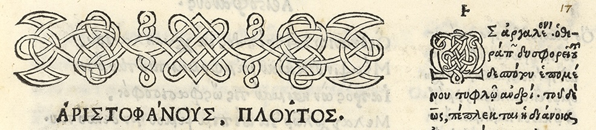

# Aristophanis Canticorum Omniorum Responsio Accentuum

[](https://doi.org/10.5281/zenodo.16603568)


See [this notebook](nb_results.ipynb) for the results. The data are available in a custom XML format in the ```data/compiled``` folder.  A slide presentation of the method and the results is available [here](Albin_Plotting_Poetry.pdf).

This is a spearhead study, and follow-up studies applying the same method and software on the rest of archaic polystrophic Greek lyric are already underway [here](https://github.com/Urdatorn/responsio-accentuum), starting with Pindar.

## Corpus

The corpus consists of all the **78** Aristophanic cantica (songs, chorals) that have responding strophes, i.e. that are either antistrophic (exactly two strophes) or polystrophic (that have 3 or 4 strophes):

- ✅ Ach.: 9 (1 polystrophic with 4 strophes)
- ✅ Eq.: 8 (1 polystr. with 4 str.)
- ✅ Nu.: 6
- ✅ V.: 8
- ✅ Pax: 6 (1 polystr. with 3 str.)
- ✅ Av.: 10
- ✅ Lys.: 8 (1 polystr. with 4 str.)
- ✅ Th.: 4
- ✅ Ra.: 11 (2 polystr. with 3 and 4 str. resp.)
- ✅ Ec.: 6 
- ✅ Pl.: 2

Line pairs whose responsion has disappeared due to irremediable textual corruption are excluded, in general following the discretion of Parker's edition of *The Songs of Aristophanes*. For more information, see the slides. 

## Copyright and citation

The script `stats_comp.py` contains adaptations of code from the [Greek-Poetry](https://github.com/aconser/Greek-Poetry) repository, which is copyright Anna Conser 2022 under the MIT licence. The license is quoted in its entirety in the doc string of that file.

This repository, however, is under the copyleft GNU GPL 3 license (compatible with the MIT license), which means you are more than welcome to fork and build on this software for your own open-science research, as long as your code retains an equally generous licensing. If you have found this repository useful, please cite it in the following way:

> Thörn Cleland, Albin Ruben Johannes (2025, June 16-18). Hidden Choral Stimuli: The Role of Accent in the Refrains of Aristophanes [Conference presentation]. PLOTTING POETRY 8: Skeletons in the Closet, Prague, The Czech Republic.

```
@inproceedings{thorncleland2025hidden,
  author       = {Thörn Cleland, Albin Ruben Johannes},
  title        = {Hidden Choral Stimuli: The Role of Accent in the Refrains of Aristophanes},
  eventtitle   = {PLOTTING POETRY 8: Skeletons in the Closet},
  eventdate    = {2025-06-16/2025-06-18},
  venue        = {Prague, The Czech Republic},
  note         = {Conference presentation},
}
```
